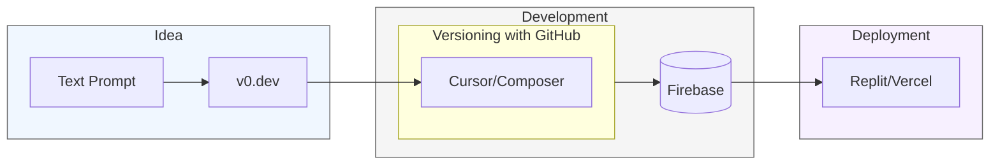

# Awesome Software Composers

## What is a software composer?
<table>
<tr>
<td width="60%">

> To be a software composer is to select, arrange and blend pre-existing components, libraries and APIs into a complete and expressive solution.

Software composers use AI & LLM powered tools to move from idea -> code -> deployment quickly and expressively with natural language. For a longer introduction read [The Rise of the Software Composer](https://tolacapital.com/2024/11/13/the-rise-of-the-software-composer-a-new-era-of-software-creation).

</td>
<td width="40%">

</td>
</tr>
</table>

## Table of Contents
- [Getting started](#getting-started)
  - [Education](#education)
  - [The most popular workflow](#the-most-popular-workflow)
- [Active Communities](#active-communities)
- [Tools](#tools)
  - [The most popular tools](#the-most-popular-tools-that-enable-the-software-composer-workflow)
  - [One-stop shop products](#one-stop-shop-products)
  - [All tools by category](#all-tools-by-category)
    - [Foundation Models](#foundation-models)
    - [Frontend AI tools](#frontend-ai-tools)
    - [Frontend Libraries](#frontend-libraries)
    - [AI Code Editors & Co-pilots](#ai-code-editors--co-pilots)
    - [Backend & Persistence](#backend--persistence)
    - [Deployment & Hosting](#deployment--hosting)
    - [Version Control & Collaboration](#version-control--collaboration)
    - [Authentication & Identity](#authentication--identity)
- [In the wild](#in-the-wild)
  - [Real Applications](#real-applications)
  - [On X (Twitter)](#on-x-twitter)

## Getting started

### Education 

- [Takeoff](https://www.jointakeoff.com/) - [McKay Wrigley's](https://x.com/mckaywrigley) popular paid courses for learning to code with Cursor and build apps with AI
- [Software Composer's beginners guide](https://community.softwarecomposer.com/c/beginner-guide/) - 7 free lessons that cover the basics of using Replit, Firebase, Cursor and Git to compose software from [Riley Brown](https://x.com/rileybrown_ai)
- Free Youtube Videos
    - [Cursor AI tutorial for beginners](https://www.youtube.com/watch?v=gqUQbjsYZLQ) - [Greg Isenberg](https://x.com/gregisenberg) and [Ras Mick](https://x.com/rasmickyy) dive deep into the frameworks and strategies on how to best use Cursor AI. 
    - [Coding an app with AI in 67 minutes](https://www.youtube.com/watch?v=kDcM_xwmP3Q) - [Greg Isenberg](https://x.com/gregisenberg) and [Riley Brown](https://x.com/rileybrown_ai) conduct a live coding session and build an app with just AI.
    - [Essential AI Coding Fundamentals](https://www.youtube.com/watch?v=BblTkXR-3eo) - [Greg Isenberg](https://x.com/gregisenberg) and [Jason Zhou](https://x.com/jasonzhou1993) detail a more advanced spec driven approach to use Cusor to build an app. 
- [Clair Vo's Maven Lightning Lessons](https://maven.com/p/317f53/the-ai-powered-product-manager) - Clair Vo shows how she goes from feature specification to deployed code using ChatPRD, V0, Cursor and Devin.

### The most popular workflow 

Software composers are using a combination of tools to move from idea -> code -> deployment but the most popular workflow is as follows:

Idea
- V0 to generate an initial UI design from a text prompt

Code
- Cursor and composer to generate the code to implement the design
- Git & GitHub to version control 
- Firebase to persist the data

Deployment
- Replit or Vercel to deploy the application

## Active Communities

- [Software Composers](https://www.softwarecomposer.com/) - An independent community of over 7000 software composers started by [Riley Brown](https://x.com/rileybrown_ai)
- [/r/ChatGPTCoding](https://www.reddit.com/r/ChatGPTCoding/) - A very active subreddit for using AI to code (not just ChatGPT)
- [r/LLMDevs](https://www.reddit.com/r/LLMDevs/) - A subreddit for Developers and Enthusiasts to discuss the application of LLM and NLP tools
- [Cursor Forums](https://forum.cursor.com/) - The official community for Cursor
- [AI builder Club](https://www.skool.com/ai-builder-club/) - [Jason Zhou's](https://x.com/jasonzhou1993) paid skool community for learning to code with Cursor and build apps with AI

## Tools

### The most popular tools that enable the software composer workflow

- [V0](https://v0.dev) - A generative UI tool that uses AI to create React components from text prompts or images, leveraging shadcn/ui and Tailwind CSS for seamless integration.
- [Cursor](https://www.cursor.com) - An AI-powered code editor that acts as a pair programmer, assisting with code generation, refactoring, and debugging to boost productivity. Software composers takes its name from Cursor's eponymous "composer" feature.
- [Replit](https://replit.com) - A collaborative, browser-based IDE for building and sharing applications. Replit supports multiple programming languages and enables instant deployment, live previews, and real-time collaboration with other developers.
- [Firebase](https://firebase.google.com) - A Google-backed platform offering real-time databases, authentication, cloud storage, and serverless hosting for fast app prototyping and scaling.
- [Clerk](https://clerk.com) - A plug-and-play user authentication and identity service that simplifies sign-ups, logins, and account management, with support for social logins and MFA.
- [Vercel](https://vercel.com) - A cloud platform for fast, reliable web app deployment, optimized for frameworks like Next.js, with serverless functions and edge caching.
- [Github](https://github.com) - The go-to platform for version control and collaboration, offering Git hosting, pull requests, CI/CD with GitHub Actions, and project management tools.

### One-stop shop products

The following products seek to provide a one-stop shop for the software composer workflow from idea -> code -> deployment.

- [Bolt.new](https://bolt.new) - Prompt, run, edit, and deploy full-stack web apps.
- [Loveable](https://lovable.dev/) Promises idea to app in seconds. 
- [Github Spark](https://githubnext.com/projects/github-spark) - `[Technical Preview]` Enabling anyone to create or adapt software for themselves, using AI and a fully-managed runtime. Focus on building and sharing personalized micro-apps

### All tools by category

#### Foundation Models 

- [GPT-4o](https://openai.com/product/gpt-4o) - An advanced AI language model by OpenAI, designed to enhance reasoning and problem-solving capabilities across various domains.
- [GPT-4o Mini](https://openai.com/product/gpt-4o-mini) - A compact version of GPT-4o, offering similar advanced reasoning abilities in a more resource-efficient package.
- [GPT-o1 preview](https://openai.com/product/gpt-o1-preview) - A preview of OpenAI’s upcoming model, GPT-o1, focusing on improved human-like reasoning and complex task-solving.
- [Claude 3.5 Sonnet](https://www.anthropic.com/claude/sonnet) - Anthropic’s AI model optimized for enhanced reasoning, coding skills, and computer use, featuring a 200K context window.
- [Claude 3.5 Haiku](https://www.anthropic.com/claude/haiku) - A fast AI model by Anthropic, delivering advanced coding, tool use, and reasoning at an accessible price point.
- [Gemini 1.5 Pro](https://deepmind.google/technologies/gemini/pro/) - Google DeepMind’s AI model offering general performance across a wide range of tasks, with a context window of up to two million tokens.
- [Gemini 1.5 Flash](https://deepmind.google/technologies/gemini/flash/) - A lightweight, fast, and cost-efficient AI model by Google DeepMind, optimized for speed and efficiency with a context window of up to one million tokens.
- [Poolside](https://poolside.ai/) - An AI platform focused on software engineering, offering foundation models, an API, and an assistant to enhance developer productivity.
- [DeepSeek Coder](https://deepseekcoder.github.io/) - A Chinese AI model developed by DeepSeek, known for its strong performance in natural language processing tasks.

#### Frontend AI tools

- [V0](https://v0.dev) - A generative UI tool that uses AI to create React components from text prompts or images, leveraging shadcn/ui and Tailwind CSS for seamless integration.
- [Magic Pattern](https://www.magicpattern.design) - A generative UI tool that uses AI to create CSS patterns from text prompts or images, leveraging Tailwind CSS for seamless integration.
- [Uizard](https://uizard.io) - An AI-powered design tool that transforms text prompts into editable UI designs, facilitating rapid prototyping and iteration.
- [Visily](https://www.visily.ai) - Offers AI-driven features like converting text descriptions, sketches, or screenshots into editable wireframes and mockups, streamlining the design process.
- [Galileo AI](https://www.usegalileo.ai) - Generates editable UI designs from simple text prompts, assisting designers in quickly visualizing and iterating on ideas.
- [Components AI](https://components.ai) - Provides tools for creating generative design systems, including responsive components and pages, with a focus on computational theming and accessibility.
- [Figma AI](https://www.figma.com/ai/) - Figma’s AI features, including “First Draft,” utilize generative AI to assist designers in creating app designs from text prompts. These tools offer various design libraries, from low-fidelity wireframes to high-fidelity visuals, streamlining the design process

#### Frontend Libraries

- [Shadcn](https://ui.shadcn.com) - A library of pre-built components that can be used to create React applications with a focus on consistency and ease of use.
- [Tailwind CSS](https://tailwindcss.com) - A utility-first CSS framework for rapidly building custom designs.

#### AI Code Editors & Co-pilots

- [Cursor](https://www.cursor.com) - An AI-powered code editor that acts as a pair programmer, assisting with code generation, refactoring, and debugging to boost productivity. Software composers takes its name from Cursor's eponymous "composer" feature.
- [GitHub Copilot](https://github.com/features/copilot) - The world's first AI code editor and pair programmer
- [Codeium Windsurf](https://codeium.com) - An AI-powered IDE by Codeium that enhances developer productivity through real-time agentic collaboration and advanced code generation features.
- [Zed](https://zed.dev) - A fast, collaborative code editor designed for modern development teams, with real-time pair programming and a minimal interface.
- [Aider AI](https://www.aider.chat) - A chatbot-style AI tool for developers that assists with coding tasks, debugging, and project management.
- [Tabnine](https://www.tabnine.com) - An AI code assistant that accelerates and simplifies software development while keeping your code private, secure, and compliant.
- [GPT Engineer](https://github.com/gpt-engineer-org/gpt-engineer) - `[Open Source]` Platform to experiment with the AI Software Engineer. Terminal based.
- [Cline](https://github.com/cline/cline) - `[Open Source]` Autonomous coding agent right in your IDE, capable of creating/editing files, executing commands, using the browser, and more with your permission every step of the way
- [PearAI](https://trypear.ai/) - `[Open Source]` An Open Source AI Code Editor similar to Cursor
- [SourceGraph Cody](https://sourcegraph.com/cody) - AI-powered code search and explanation tool, providing insights into large codebases and improving developer productivity.
- [Jetbrains AI](https://www.jetbrains.com/ai) - An integrated feature in JetBrains IDEs that leverages AI to enhance development workflows with capabilities like code generation, context-aware completion, and automated test creation.

#### Backend & Persistence

- [Firebase](https://firebase.google.com) - A Google-backed platform offering real-time databases, authentication, cloud storage, and serverless hosting for fast app prototyping and scaling.
- [Supabase](https://supabase.com) - An open-source Firebase alternative providing tools like PostgreSQL, real-time updates, authentication, and storage for scalable backend development.

#### Deployment & Hosting

- [Vercel](https://vercel.com) - A cloud platform for fast, reliable web app deployment, optimized for frameworks like Next.js, with serverless functions and edge caching.
- [Netlify](https://www.netlify.com) - Similar to Vercel, a platform for building and deploying web apps, offering continuous deployment, serverless functions, and a CDN for fast content delivery.
- [Replit](https://replit.com) - A collaborative, browser-based IDE for building and sharing applications. Replit supports multiple programming languages and enables instant deployment, live previews, and real-time collaboration with other developers.

#### Version Control & Collaboration

- [Github](https://github.com) - The go-to platform for version control and collaboration, offering Git hosting, pull requests, CI/CD with GitHub Actions, and project management tools.
- [Gitlab](https://gitlab.com) - A Git-based platform for collaboration, offering project management, CI/CD pipelines, and a range of tools for software development.

#### Authentication & Identity

- [Clerk](https://clerk.com) - A plug-and-play user authentication and identity service that simplifies sign-ups, logins, and account management, with support for social logins and MFA.
- [Auth0](https://auth0.com) - A comprehensive authentication and authorization platform that supports a wide range of identity providers, including social logins, and offers flexible configuration options for secure authentication.

## In the wild

### Real Applications 
- [ChatPRD](https://www.chatprd.ai/) - An on-demand AI copilot for product managers to generate product requirements documents largely software composed by [Clair Vo](https://x.com/clairvo)
- [YapThread: AI Voice Notes](https://yapthread.com) - A voice note app that uses AI to transcribe and summarize voice notes software composed by [Riley Brown](https://x.com/rileybrown_ai)
- [Spun It: The Social Network for Vinyl Lovers](https://spunit.io/) - A mobile app that lets you track, log, and share your vinyl record spins with friends composed by [u/spliket](https://www.reddit.com/user/spliket/)

### On X (Twitter)

- An [crypto exchange UI](https://x.com/Tristan0x/status/1830102400872693985) by [@Tristan0x](https://x.com/Tristan0x)
- An [AI photo generator](https://x.com/mckaywrigley/status/1829982464653345178) by [@mckaywrigley](https://x.com/mckaywrigley)
- [Figma Plugins](https://x.com/damianoredem/status/1827113234262004147) by [@damianoredem](https://x.com/damianoredem)
- A full fledged [video editor](https://x.com/MengTo/status/1826955943311241611) by [@MengTo](https://x.com/MengTo)
- A [harry potter app](https://x.com/rickyrobinett/status/1825581674870055189) by [@rickyrobinett](https://x.com/rickyrobinett)'s daughter
- A [background remover tool](https://x.com/mattppal/status/1828829915460075540) by [@mattppal](https://x.com/mattppal)
- A [chrome extension](https://x.com/moritzkremb/status/1828749774499254738) by [@moritzkremb](https://x.com/moritzkremb)
- An [iphone game with sound](https://x.com/gong_cn/status/1829040895146242185) by [@gong_cn](https://x.com/gong_cn)
- An app [called pin or drop](https://x.com/rileybrown_ai/status/1830014436746412164) by [@rileybrown_ai](https://x.com/rileybrown_ai)
- A [stock price dashboard](https://x.com/mjovanovictech/status/1829627967250583643) by [@mjovanovictech](https://x.com/mjovanovictech)
- A [cursor analytics dashboard](https://x.com/thehamedmp/status/1824216074579218678) by [@thehamedmp](https://x.com/thehamedmp)
- A [location based travel app](https://x.com/zenowang98/status/1856744501441933770) by [@zenowang98](https://x.com/zenowang98)
- An [air conditioner size calculator](https://x.com/Shpigford/status/1819429974287233413) by [@Shpigford](https://x.com/Shpigford)

